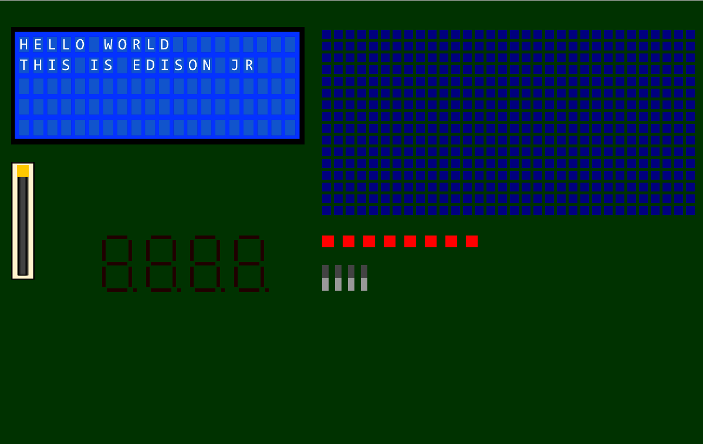

Edison Jr.
==========

Edison Jr. provides a free, open source, and cross platform virtual alternative to physical experiment boards.

Please note is a fork from the original [here](https://bitbucket.org/miniat_amos/edison_jr). I wanted to have this project on GitHub.
More information about this can be found [here](http://web.cs.sunyit.edu/~pereztr/classes/370.html).

It currently works on:  
- Mac OSX  
- Linux (Tested on Ubuntu)

#### Prerequisites

For a complete guide to install MiniAT go to [miniat.org](http://www.miniat.org/getting-started/build)

- SDL2
- [MiniAT](https://bitbucket.org/miniat/0x1-miniat)

Make sure you are able to run the example on [miniat.org](http://www.miniat.org/getting-started/running-an-example) before you run Edison Jr.

#### Download Edison Jr.

##### Using Git:  
- Clone it into your systems directory of MiniAT ` miniat/system/ `  
` cd ~/miniat/systems/ `  
` git clone https://bitbucket.org/miniat_amos/edison_jr.git `  

#### Environment paths for Edison Jr.
Edison Jr. requires the user to add a path to the image directory.
##### Temporary path  
Bash:  
- Add the image path which Edison Jr. uses  
` export EDISON_PATH=~/miniat/system/edison_jr/SDL/images/ `  

Tcsh:  
- Add the image path  
` setenv EDISON_PATH ~/miniat/system/edison_jr/SDL/images/ `  

If your wish to have this path added every time you are in terminal then add the command to your ` .bash_profile `, ` .bashrc `, or ` .profile ` file

#### Running Edison Jr. Examples
- Run the command from your ` miniat ` dir  
- First test and see if Edison Jr. loads  
` miniat_edisonJr out/bin/hello_world.bin `  
- Now to run the example that has some functionality  
` miniat_edisonJr out/bin/example1.bin `  
- You can also run our segment display test  
` miniat_edisonJr out/bin/testssd.bin `  

#### Address Scheme
##### LCD  
| Address            | Command         | Description                  |
| ------------------ | --------------- | ---------------------------- |
| 0x4040             | LCD X           | Moves cursor X position      |
| 0x4041             | LCD Y           | Moves cursor Y position      |
| 0x4042             | LCD CHAR        | Puts char in cursor position |

##### 4 - Seven Segment Display  
| Address            | Command         | Description                   |
| ------------------ | --------------- | ----------------------------- |
| 0x4010             | Segment 1       | Input state of the 8 states   |
| 0x4011             | Segment 2       | Input state of the 8 states   |
| 0x4012             | Segment 3       | Input state of the 8 states   |
| 0x4013             | Segment 4       | Input state of the 8 states   |

##### LED Matrix  
| Address            | Command         | Description                      |
| ------------------ | --------------- | -------------------------------- |
| 0x4000             | Matrix X        | Sets/gets X coordinate of cursor |
| 0x4001             | Matrix Y        | Sets/gets Y coordinate of cursor |
| 0x4002             | Color           | Gets color under x,y coordinate  |
| 0x4003             | Circle          | Lights up all LEDs in a Circle   |
| 0x4004             | Square          | Lights up all LEDs in a square   |

##### Buttons
| Address            | Command             | Description                                |
| ------------------ | ------------------- | ------------------------------------------ |
| 0x4020             | Read Button         | Returns the state of the button in binary  |

##### DIP Switch
| Address            | Command         | Description                                   |
| ------------------ | --------------- | --------------------------------------------- |
| 0x4030             | Read DIP Switch | Returns the state of the DIP Switch in binary |
